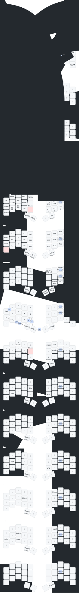

# @JJGadgets ZMK Configuration

## Layer types
**Core**: Main layers used for normal typing usage.
**Util**: Utility layers that are "nice-to-haves", such as macro layers.
**Alt**: Alternate layers to core layers, such as gaming layers.
**Helper**: Layers used to implement functionality, such as layer lock.

## Current Keyboards

### Ferris Sweep
34 keys, nice!nano v2, cradio.keymap

Core: default, num, navi, fn
Util: term & its children
Alt: game
Helper: num_hold, num_lock, lock

